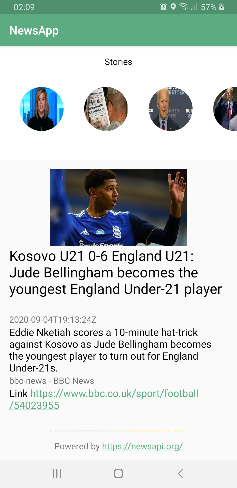

# NewsApp

## Acknowledgement
The data is collected from [NewsApi.org](https://newsapi.org/)

# Preview

# Description
Hello there!

So I was struggling with this android pagination stuffs for quite some time now. You see,
most of the tutorials are either really old(you don't want to see them), some only show you the paging
library with networking support only, some only show database support, some don't show a loader at the
ena of recyclerView and so on.Finally, last night I was able to code a sample pagination app successfully
with networking, database support, a little loader at the bottom and an extra row at top(you know, for
displaying stories/my day/ whatever you call it). So finally after understanding all these things properly,
I wish to keep all of it in this project. I hope you'll like it.

We'll be using android paging library 2.1.2 as it is production ready. Though the paging library 3.0 alpha
is released, it's still in alpha. So it might not be a good idea to use it in production. Hence the
version 2.1.2.

Please go through the followings:

[1. Add Api Key](./docs/1-Add-NewsApiKey.md)

[2. Use Retrofit](./docs/2-Add-Retrofit-Client.md)

[3. Use Room](./docs/3-Add-Room-Database-Codes.md)

[4. Init RecyclerViewAdapter](./docs/4-Add-RecyclerViewAdapter.md)

[5. Connect Database with RecyclerView](./docs/5-connect-database-with-recyclerview.md)

[6. Use BoundaryCallBack to Trigger Network Call](./docs/6-connect-boundary-callback-with-network.md)

[7. Add a Footer/Loader](./docs/7-add-a-footer-loading.md)

[8. Add Stories at the Top](./docs/8-Add-stories-on-top.md)

[9. Add MVVM support](./docs/9-MVVM.md)

[10. Force Refresh on Swipe](./docs/10-force-refresh-on-swipe.md)

[11. Factory Pattern For Online and Offline Support](docs/11-Factory-Pattern-For-Online-Offline-Support.md)

If you have any questions, feel free to ask me and I'll try my utmost to answer you.

Thank you for reading.

# References
1. [https://www.raywenderlich.com/6948-paging-library-for-android-with-kotlin-creating-infinite-lists](https://www.raywenderlich.com/6948-paging-library-for-android-with-kotlin-creating-infinite-lists)
2. [https://blog.mindorks.com/implementing-paging-library-in-android](https://blog.mindorks.com/implementing-paging-library-in-android)
3. [https://proandroiddev.com/8-steps-to-implement-paging-library-in-android-d02500f7fffe](https://proandroiddev.com/8-steps-to-implement-paging-library-in-android-d02500f7fffe)
4. [https://medium.com/@sharmadhiraj.np/android-paging-library-step-by-step-implementation-guide-75417753d9b9](https://medium.com/@sharmadhiraj.np/android-paging-library-step-by-step-implementation-guide-75417753d9b9)
