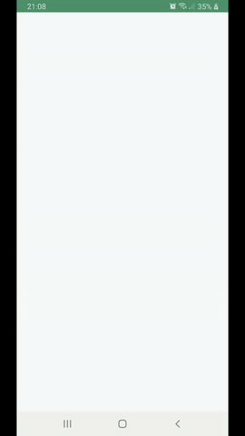

# Add a Footer / Loading
Now we want to add a loader to make things a bit pretty. Create an enum
```
enum class LoaderState {
    DONE, LOADING, ERROR
}
```

This will help us to keep track of our loading states.
In the main activity, create a LiveData<LoaderState> object. LiveData helps us with some trigger stuffs.
Whenever the liveData value changes, it will auto-trigger a change. So all we have to do is, define what
changes will take place (in this case, show / hide a loader).

So in main activity, we add this:
```
        liveLoaderState.observe(this, Observer<LoaderState>{
            newState -> newsFeedAdapter?.setLoaderState(newState);
        })
```

Now open the adapter, and make these changes:
```
    override fun getItemCount(): Int {
        return OFFSET_KOUNT + super.getItemCount() + isLoading();
    }

    /** private methods */
    fun isLoading():Int {
        if(state.equals(LoaderState.LOADING))
            return 1;
        return 0;
    }

    /** public apis */
    public fun setLoaderState(newState: LoaderState) {
        this.state = newState;
        notifyDataSetChanged();      // <-- this tells the adapter to update the ui
    }
```

Finally, we make a change in out NewsBoundaryCallback class by passing a `liveLoaderState: MutableLiveData<LoaderState>`
parameter. Create a field to hold on to this reference. Now inside `onZeroItemsLoaded()` and `onItemAtEndLoaded()`
we will simply update it's value like this:

```
    var call:Call<NewsApiResponse> = api.fetchFeed("bbc-news", Const.API_KEY, pageNumber, Const.PAGE_SIZE);

    liveLoaderState.postValue(LoaderState.LOADING);  // <-----

    call.enqueue(object: Callback<NewsApiResponse>{
           override fun onResponse(call: Call<NewsApiResponse>, response: Response<NewsApiResponse>) {
             // check if successfull
             liveLoaderState.postValue(DONE);
             // ...
           }

           override fun onFailure(call: Call<NewsApiResponse>, t: Throwable){
             liveLoaderState.postValue(ERROR);
           }
    }
```

Simply run the code, and you'll see the loader. Now it might be hard to see the loader if your network
connection is good. If you can't see it properly, try this: open `Const.kt` file and change `PAGE_SIZE = 1`,
this will allow you to see the loader(but don't try this on your production app!)

